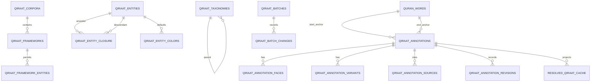

# Qiraat annotation engine — target data model

## Design boundary

This model adds a normalized **authoring overlay** beside the existing V2 fixture/provenance model. It does not modify `textUthmani`, QCF glyph data, `mushaf_annotations`, or the existing imported `qiraat_entries` corpus. A future approved bridge can expose verified imported records in the editor, but source transcription is never silently recast as manual scholarship.

## Master data

| Table | Key fields and constraints | Purpose |
|---|---|---|
| `quran_words` | surrogate `id`; `surah`, `ayah`, `word_position`; generated/stored `canonical_key`; `UNIQUE(surah, ayah, word_position)`; `current_mushaf_word_id`, `page_number` | Immutable semantic word registry, seeded only from existing page fixtures. |
| `qiraat_corpora` | UUID, unique `code`, names, active | Reading systems, e.g. the verified target code/name for Al-Ashr Al-Sughra. |
| `qiraat_frameworks` | UUID, `corpus_id`, unique `(corpus_id, code)` | Al-Shatibiyya / Al-Durra remain frameworks, not entity parents. |
| `qiraat_entities` | UUID, stable `legacy_authority_id` nullable/unique, `entity_type` reader/narrator/tariq, names, `parent_id`, active, metadata | Transmission tree; extends/adapts the existing authorities without inventing routes. |
| `qiraat_entity_closure` | `(ancestor_id, descendant_id)` primary key, nonnegative `depth` | Write-maintained ancestry/descendency lookup. |
| `qiraat_framework_entities` | framework/entity relation, status/evidence metadata | States permitted framework membership independently of the hierarchy. |
| `qiraat_taxonomies` | UUID, parent, `category_type` USUL/FARSH, code, names, active, sort order | Database-driven nested rule taxonomy. |
| `qiraat_groups`, `qiraat_group_members` | group is optional corpus/framework scoped; member FK to entity | Presets expand to concrete entities; never a transmission node. |
| `qiraat_sources` | UUID, type, title, author, optional framework, metadata | Bibliographic/evidence source distinct from framework. |
| `qiraat_entity_colors` | entity + optional display context, `default_color` | Default presentation metadata. Existing `color_hex` may be mirrored through an explicit migration; an annotation never mutates it. |

The Phase 1 migration will reserve, but not seed, groups, routes, framework memberships and taxonomy terms lacking a verified project source. It will not infer them from popular lists.

## Annotation write model

`qiraat_annotations` is one explicit entity/rule/scope assignment. Selecting multiple entities and rules in the UI expands into several unambiguous rows; it never stores an ambiguous combined list.

| Field group | Required shape |
|---|---|
| Identity | UUID `id`, `version` integer, timestamps/users, nullable `deleted_at` |
| Scope | `scope_type` WORD/RANGE/BOUNDARY; `start_word_id`, `end_word_id`; denormalized checked `start_canonical_key`, `end_canonical_key` |
| Context | `reading_context` BOTH default, WASL_ONLY, WAQF_ONLY |
| Meaning | taxonomy FK, target entity FK, corpus/framework FKs, `inheritance_action` INHERIT/OVERRIDE/EXCLUDE, `applies_to_descendants` |
| Editorial | status draft/reviewed/verified (default draft); entry_method manual/excel/json/ai/batch/migration; notes; nullable `color_override` |

Server validation confirms anchors exist, scope/order shape is valid (including cross-ayah), entity is permitted by the selected framework, taxonomy/source/face links exist, and all enum/status values are allowed. The API requires `expected_version` for updates/deletes. An SQL conditional update (`WHERE id = $id AND version = $expected`) increments the version; zero affected rows returns 409 with a current-server summary rather than overwriting newer work.

`qiraat_annotation_faces` stores structured Awjuh: annotation FK, `face_type`, typed/string `face_value`, labels, nullable `preference_status` (muqaddam/secondary/equal), ordering and JSON metadata. `NULL` remains the default preference.

`qiraat_annotation_variants` stores optional alternate display/phonetic detail per annotation or face: optional face FK, canonical key, optional Uthmani/normalised text, phonetic note, render mode, glyph reference and metadata. It is an overlay only.

`qiraat_annotation_sources` is a many-to-many relation to `qiraat_sources` with chapter/section, bayt/page, reference text and notes.

`qiraat_annotation_revisions` captures every meaningful mutation: annotation ID, revision number, before/after JSON, actor/time/reason. Restore creates a new current version and revision; history is never rewritten.

`qiraat_face_constraints` is reserved for future allowed/prohibited cross-rule face combinations; no Tahrirat solver is introduced now.

## Deterministic resolution and read cache

For a target entity and matching anchor/context/framework:

1. find direct annotations and ancestor annotations using `qiraat_entity_closure`;
2. reject annotations whose context does not match;
3. rank direct target before narrator before reader (shortest ancestor depth wins); ties use current annotation revision/time/UUID deterministically;
4. a direct rule always wins; otherwise the nearest ancestor with `applies_to_descendants=true` wins. This applies identically to `INHERIT`, `OVERRIDE`, and `EXCLUDE`; a direct Tariq override may supersede an inherited exclusion. See `QIRAAT_INHERITANCE_POLICY.md`;
5. write the effective result to the cache in the same transaction as the mutation.

`resolved_qiraat_cache` stores the read projection: canonical key/word ID, page accelerator, target entity, corpus/framework, resolved annotation ID, face count, variant summary, resolved colour, reading context, source annotation version, cache revision, metadata and timestamp. Its semantic uniqueness centres on `(canonical_word_key, target_entity_id, framework_id, reading_context)`; page is indexed but never identity.

The resolver calculates only affected descendants and anchors/pages. Normal page reads fetch cached rows by page and filter/status, with no recursive resolution. If cache projection fails, the whole annotation transaction fails; an observable health/query check reports cache revision lag.

The cache trigger invalidates only descendants of the changed authority and the changed annotation's start/end canonical keys under its framework. The resolver suite verifies this branch/scope isolation and queries the cache directly; the page read path is `resolved_qiraat_cache` by page index, never a recursive hierarchy query.

## Batch model

`qiraat_batches` tracks candidate/preview/apply/validated/committed/rolled-back state and entry method. `qiraat_batch_changes` records every INSERT, UPDATE or DELETE with batch ID, table/entity, record ID, before/after JSON, sequence and timestamp. `rollback_batch(batch_id)` reverses changes in descending sequence inside one transaction, validates domain state, refreshes affected cache rows, and commits or rolls back atomically. Revisions and audit timestamps are intentionally not expected to equal their pre-batch values.

## Existing-schema coexistence

Existing `qiraat_authorities`, `qiraat_loci`, `qiraat_entries`, evidence and their derived `qiraat_entry_readings` projection remain source-import infrastructure. New authoring tables use explicit `qiraat_annotation_*` names to avoid collision. A later bridge may map a verified legacy entry/locus to canonical anchors and an annotation revision, with provenance retained; it is not part of schema creation or automatic seed data.
