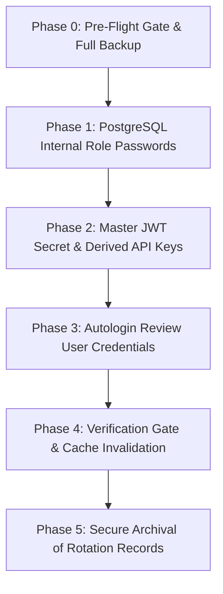

# Postgres & Supabase Credential Rotation Runbook

**Document Version:** 1.0  
**Date:** 2026-09-24  
**Status:** **PLAN ONLY — DO NOT EXECUTE WITHOUT EXPLICIT OPERATIONAL SIGN-OFF**  
**Target Infrastructure:** Mac mini host (`100.88.212.88` / `192.168.1.11`), Docker container stack `mutshabehat-db:5433`, Vercel production (`mutshabehat-v2.vercel.app`).

---

## 1. Inventory of Secrets and References

Every credential across the Mutshabehat V2 and Qiraat architecture is mapped below:

| Secret Identifier | Usage / Scope | Locations & Files Referencing It |
| :--- | :--- | :--- |
| **`POSTGRES_PASSWORD`** | Superuser password for PostgreSQL 17 (`postgres` role) | 1. `/Volumes/External Mini/Projects/apps/mutshabehat-selfhost/.env`<br>2. `/Volumes/External Mini/Projects/apps/mutshabehat-selfhost/docker-compose.yml`<br>3. Local DB maintenance scripts (`scripts/qiraat/import_to_postgres.py`)<br>4. Host backup crons/scripts in `mutshabehat-selfhost/backups/` |
| **`JWT_SECRET`** | Master HMAC secret signing all Supabase JWTs | 1. `mutshabehat-selfhost/.env`<br>2. PostgREST config (`PGRST_JWT_SECRET`)<br>3. GoTrue / Auth service config (`GOTRUE_JWT_SECRET`) |
| **`ANON_KEY`** | Public client JWT (role: `anon`) | 1. `mutshabehat-selfhost/.env`<br>2. Vercel Production (`NEXT_PUBLIC_SUPABASE_ANON_KEY`)<br>3. Web repo `.env.local`<br>4. Client code (`src/lib/supabase.ts`, `src/lib/supabase-server.ts`) |
| **`SERVICE_ROLE_KEY`** | Secret admin JWT (role: `service_role`, bypasses RLS) | 1. `mutshabehat-selfhost/.env`<br>2. Vercel Production (`SUPABASE_SERVICE_ROLE_KEY`)<br>3. Web repo `.env.local`<br>4. Quiz and review backend handlers (`src/lib/quiz/repository.ts`) |
| **`PG_META_CRYPTO_KEY`** | Supabase Studio / metadata encryption key | 1. `mutshabehat-selfhost/.env`<br>2. Docker compose `studio` service |
| **`AUTOLOGIN_PASSWORD`** | Password for the dedicated review/guest reader user | 1. `mutshabehat-selfhost/.autologin-password.txt`<br>2. Vercel Production (`AUTOLOGIN_PASSWORD`)<br>3. `src/proxy.ts` |
| **`SMTP_PASS`** | Outbound mailer password for auth invites | 1. `mutshabehat-selfhost/.env` (SMTP service) |

---

## 2. Rotation Sequencing & Dependency Ordering

Rotating credentials out of order will break live production traffic. The mandatory sequential order is:



---

## 3. Step-by-Step Execution Protocol

### Phase 0: Pre-Flight Gate & Full Backup
1. **Take full binary pg_dump backup:**
   ```bash
   BACKUP_DIR="/Volumes/External Mini/Projects/apps/mutshabehat-selfhost/backups"
   TIMESTAMP=$(date -u +"%Y%m%dT%H%M%SZ")
   docker exec -e PGOPTIONS="-c default_transaction_read_only=on" mutshabehat-db \
     pg_dump -U postgres -d postgres -Fc > "$BACKUP_DIR/pre-rotation-$TIMESTAMP.dump"
   ```
2. **Snapshot all current configuration files:**
   ```bash
   cp "/Volumes/External Mini/Projects/apps/mutshabehat-selfhost/.env" \
      "$BACKUP_DIR/.env.pre-rotation-$TIMESTAMP"
   cp "/Volumes/External Mini/Projects/apps/mutshabehat-selfhost/.secrets.json" \
      "$BACKUP_DIR/.secrets.json.pre-rotation-$TIMESTAMP"
   ```
3. **Verify backup size and test read:**
   ```bash
   ls -lh "$BACKUP_DIR/pre-rotation-$TIMESTAMP.dump"
   pg_restore --list "$BACKUP_DIR/pre-rotation-$TIMESTAMP.dump" | head -n 15
   ```

---

### Phase 1: Rotate PostgreSQL Role Passwords
1. **Generate high-entropy password (32+ alphanumeric):**
   ```bash
   NEW_PG_PASS=$(openssl rand -base64 32 | tr -dc 'a-zA-Z0-9' | head -c 32)
   ```
2. **Update password inside PostgreSQL:**
   ```bash
   docker exec -i mutshabehat-db psql -U postgres -d postgres -c \
     "ALTER USER postgres WITH PASSWORD '$NEW_PG_PASS';"
   docker exec -i mutshabehat-db psql -U postgres -d postgres -c \
     "ALTER USER supabase_admin WITH PASSWORD '$NEW_PG_PASS';"
   ```
3. **Update `.env` in selfhost stack:**
   Update `POSTGRES_PASSWORD=<NEW_PG_PASS>` in:
   `/Volumes/External Mini/Projects/apps/mutshabehat-selfhost/.env`
4. **Restart connected stack components:**
   ```bash
   cd "/Volumes/External Mini/Projects/apps/mutshabehat-selfhost"
   docker compose restart rest auth studio
   ```
5. **Verify DB connectivity:**
   ```bash
   docker exec mutshabehat-db psql -U postgres -d postgres -c "SELECT 1;"
   ```

---

### Phase 2: Rotate Master JWT Secret & Derived API Keys
Changing `JWT_SECRET` invalidates all existing client sessions and requires updating both PostgREST and Vercel.

1. **Generate new JWT Secret (64 hex characters):**
   ```bash
   NEW_JWT_SECRET=$(openssl rand -hex 32)
   ```
2. **Mint new `ANON_KEY` and `SERVICE_ROLE_KEY`:**
   Using the standard Supabase payload generator (Node.js script):
   - Anon payload: `{"role": "anon", "iss": "supabase", "iat": <NOW>, "exp": <NOW+5years>}`
   - Service role payload: `{"role": "service_role", "iss": "supabase", "iat": <NOW>, "exp": <NOW+5years>}`
   Sign both with `NEW_JWT_SECRET` using HS256.
3. **Update Self-Hosted Backend:**
   Update `JWT_SECRET`, `ANON_KEY`, and `SERVICE_ROLE_KEY` in:
   `/Volumes/External Mini/Projects/apps/mutshabehat-selfhost/.env`
   Restart PostgREST and GoTrue:
   ```bash
   docker compose restart rest auth
   ```
4. **Update Vercel Production Environment Variables:**
   Using Vercel CLI (or dashboard):
   ```bash
   vercel env add NEXT_PUBLIC_SUPABASE_ANON_KEY production
   vercel env add SUPABASE_SERVICE_ROLE_KEY production
   ```
5. **Redeploy Vercel Production:**
   Trigger a production deployment so new serverless runtime picks up the new secrets.

---

### Phase 3: Rotate Autologin & Editorial Credentials
1. **Generate new password for autologin account:**
   ```bash
   NEW_AUTOLOGIN_PASS=$(openssl rand -base64 24 | tr -dc 'a-zA-Z0-9' | head -c 24)
   ```
2. **Update GoTrue user password via admin API:**
   Call the self-hosted GoTrue admin endpoint using the new `SERVICE_ROLE_KEY` to update the password for `AUTOLOGIN_EMAIL`.
3. **Update `.autologin-password.txt` on host:**
   ```bash
   echo "$NEW_AUTOLOGIN_PASS" > "/Volumes/External Mini/Projects/apps/mutshabehat-selfhost/.autologin-password.txt"
   chmod 600 "/Volumes/External Mini/Projects/apps/mutshabehat-selfhost/.autologin-password.txt"
   ```
4. **Update Vercel Environment:**
   Update `AUTOLOGIN_PASSWORD` in Vercel environment variables and redeploy.

---

### Phase 4: Verification & Smoke Test Gate
Execute all verification gates in exact order:
1. **Database Read-Only Connection Test:**
   ```bash
   docker exec -e PGOPTIONS="-c default_transaction_read_only=on" mutshabehat-db \
     psql -U postgres -d postgres -c "SELECT count(*) FROM quran_words;"
   ```
2. **PostgREST Health & Auth Relay Test:**
   ```bash
   curl -i http://127.0.0.1:8000/rest/v1/quran_words?limit=1 \
     -H "apikey: <NEW_ANON_KEY>" \
     -H "Authorization: Bearer <NEW_ANON_KEY>"
   ```
   *Expected:* HTTP 200 OK with single JSON record.
3. **Service Role RLS Bypass Test:**
   ```bash
   curl -i http://127.0.0.1:8000/rest/v1/qiraat_editors \
     -H "apikey: <NEW_SERVICE_ROLE_KEY>" \
     -H "Authorization: Bearer <NEW_SERVICE_ROLE_KEY>"
   ```
   *Expected:* HTTP 200 OK with editor row.
4. **Full Test Suites in Web App:**
   ```bash
   npm run test:proxy
   npm run test:quiz:integration
   npm run test:qiraat
   ```
5. **Browser Verification:**
   Navigate to `https://mutshabehat-v2.vercel.app/mushaf-1441/review` in incognito browser and confirm autologin succeeds and review cards render cleanly with zero 401/403 errors.

---

## 4. Emergency Rollback Plan

If any step fails during the rotation window:
1. **Restore configuration files:**
   ```bash
   cp "$BACKUP_DIR/.env.pre-rotation-$TIMESTAMP" \
      "/Volumes/External Mini/Projects/apps/mutshabehat-selfhost/.env"
   docker compose restart
   ```
2. **Revert PostgreSQL password:**
   If PostgreSQL was altered, run:
   ```bash
   ALTER USER postgres WITH PASSWORD '<OLD_PASSWORD>';
   ALTER USER supabase_admin WITH PASSWORD '<OLD_PASSWORD>';
   ```
3. **If Database state corrupted:**
   ```bash
   pg_restore -U postgres -d postgres --clean --if-exists \
     "$BACKUP_DIR/pre-rotation-$TIMESTAMP.dump"
   ```
4. **Re-point Vercel:**
   Restore previous Vercel environment variables from `$BACKUP_DIR/.vercel-prod-env.cloud.bak`.
