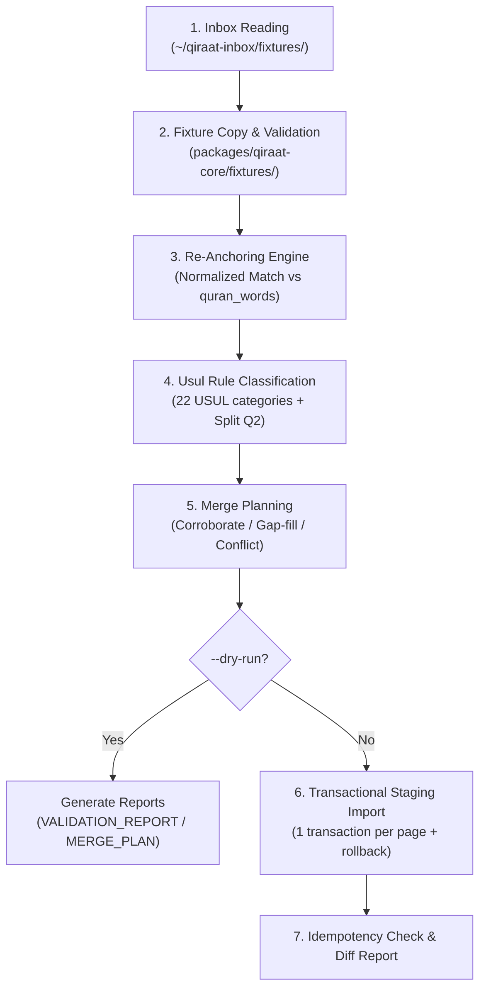

# Milestone M1 — Ingestion Pipeline Architecture & Plan

**Date:** 2026-09-24  
**Auditor / Implementer:** Antigravity  
**Target Environment:** Staging DB (`mutshabehat_staging` on `mutshabehat-db:5433`)  
**Production Guard:** Live DB (`postgres` on port 5433) remains 100% untouched. Fresh full backup created on external SSD: `/Volumes/External Mini/Projects/mutshabehat-backups/mutshabehat_prod_backup_20260924_pre_staging.dump` (12 MB).  

---

## 1. Executive Summary & Approved Decisions

Following the Milestone M0 discovery, the user approved **Option 1 for all 4 fork decisions**:
1. **Staging Environment (Q1 = Option 1)**: Dedicated cloned database `mutshabehat_staging` on the local PostgreSQL instance. Complete parity with production (77,429 words, 14,271 loci, 15,294 entries, 49,588 readings, RLS + triggers active). All ingestion tests execute strictly in staging.
2. **Multi-Word Rule Splitting (Q2 = Option 1)**: Any source rule covering multiple words (e.g. Imalah across a phrase or multiple occurrences on a page) is decomposed into individual, single-word loci records (1 record per word) for discrete 1-click review targets and word-level highlighting.
3. **Source Conflict Policy (Q3 = Option 1)**: Additive-only. When a new source reading disagrees with an existing DB entry at the same locus, both rows are preserved; the new entry is marked with `is_conflict = true`, flagged with `SOURCE_CONFLICT`, and field differences are recorded in `conflict_diff`. Existing data is never overwritten or deleted.
4. **Pilot Scope Promotion (Q4 = Option 1)**: Pages 001–040 serve as the verified pilot slice. Once validated, verified on staging, and reviewed, this slice will be promoted to production after explicit approval.

---

## 2. Ingestion Pipeline Stages (`ingest.ts`)

A single, unified CLI pipeline implemented in TypeScript under `packages/qiraat-core/` and invokable via:
```bash
npx tsx packages/qiraat-core/ingest.ts --pages 1-40 --target staging --dry-run
```



### Stage 1: Inbox Ingestion
- Reads from `~/qiraat-inbox/fixtures/pages/page-NNN.json` and `.../rulings/page-NNN.json`.
- Detects the difference between:
  - **Empty file** (`[]`): Legitimate page with zero Farsh differences (e.g. Page 112 / Surah Al-Ikhlas) → marks `done-empty`.
  - **Missing file**: Page file absent from inbox → marks `missing`, logs warning, continues processing available pages.

### Stage 2: Schema Validation & Expansion
- Verifies reading IDs and narrator IDs against `packages/qiraat-core/readers.ts` and `narrators.ts`.
- Expands «الباقون» (The remaining readers/narrators):
  - In a Farsh variant, given explicit narrators for other wajhs, «الباقون» expands to `ALL_20_NARRATORS \ {specified_narrators}`.
  - Hafs (`Q05-R02`) in «الباقون» is baseline (D8 wajh 1 = implied, omitted from variant details; only recorded if wajh_order >= 2 with note).
  - Every expansion is logged with original source text.

### Stage 3: Text Normalization & Re-Anchoring
- Token numbers in raw source fixtures are unreliable. The engine performs strict token re-anchoring against `quran_words`.
- **Normalization Function (`norm`)**:
  - Strips all Arabic tashkeel (fatha, damma, kasra, sukun, shadda, tanween).
  - Strips tatweel (kashida).
  - Strips Uthmani punctuation and waqf marks (ۖ, ۗ, ۘ, ۙ, ۚ, ۛ, ۜ, ۟, ۠, ۢ, ۣ, ۥ, ۦ, ۧ, ۨ, ۩, ۪, ۫, ۬, ۭ).
  - Unifies alif variants: `[أإآٱ]` → `ا`.
  - Unifies `[ة]` → `ه` and `[ى]` → `ي`.
- **Anchoring Algorithm**:
  - Searches the sequence of words in the given ayah in `quran_words`.
  - Single match: Assigns exact `start_word` and `end_word`. Preserves original source token index in `source_token_raw`.
  - Multiple matches in same ayah:
    * If source description or note contains «معاً» or «كلاهما»: Splits into two discrete records, one for each occurrence (e.g. 2:54 `بارئكم` words 13 and 20).
    * Otherwise: Selects the occurrence closest to the source token index; if ambiguous, flags `AMBIGUOUS_ANCHOR`.
  - Zero matches: Flags `UNMATCHED_TOKEN`, logs to report, does not insert.

### Stage 4: Rule Classification & Multi-Word Decomposition
- Matches ruling category against `USUL_RULE_REGISTRY` (22 controlled categories).
- If rule covers a multi-word span or multiple occurrences (Decision Q2), decomposes into discrete 1-word loci records.
- Ambiguous rules flagged as `Q6_AMBIGUOUS` and preserved as Farsh variants.

### Stage 5: Merge Planning (Additive Ground Truth)
Natural key: `(surah, ayah, start_word, end_word, narrator_id, kind, category_code)`.
- **Rule 1 (Corroborated)**: Both DB and new source agree on reading text and attributions. Existing entry preserved; new source attached as second evidence link in `qiraat_entry_sources`.
- **Rule 2 (Gap Filled)**: New source contains reading absent from existing DB. Inserted as new entry linked to `SRC-BOOK-27159`.
- **Rule 3 (Conflict)**: Same natural key, differing reading text or attributions. Preserves existing DB row unchanged; inserts new source row with `is_conflict = true`, `review_status = 'flagged'`, and full JSON field difference in `conflict_diff`.
- **Rule 4 (Existing Only)**: Existing DB records absent from new source are 100% preserved (additive only, zero deletions).

### Stage 6: Atomic Import (Staging First)
- One PostgreSQL transaction per page.
- On any SQL error, the entire page rolls back atomically; error logged to batch report.
- Idempotency guarantee: Running the pipeline a second time over the same pages produces exactly **0 database mutations**.

---

## 3. Schema Migration Design

A reversible migration extending the schema for multi-source attribution, conflict resolution, and page progress tracking:

### Up Migration: `supabase/migrations/20260925160000_qiraat_multi_source_ingestion.sql`
- Registers `SRC-BOOK-27159` in `qiraat_source_documents`.
- Adds `pdf_page` (integer) and `source_token_raw` (text) to `qiraat_loci`.
- Adds `pdf_page` (integer), `source_token_raw` (text), `is_conflict` (boolean default false), and `conflict_diff` (jsonb) to `qiraat_entries`.
- Creates `qiraat_entry_sources` junction table for many-to-many source citations.
- Creates `qiraat_page_ingestion_status` table tracking status across all 604 pages (`pending`, `done`, `done-empty`, `flagged`, `missing`).

### Down Rollback: `supabase/rollbacks/20260925160000_qiraat_multi_source_ingestion.down.sql`
- Drops `qiraat_page_ingestion_status` and `qiraat_entry_sources`.
- Drops added columns from `qiraat_entries` and `qiraat_loci`.
- Removes `SRC-BOOK-27159` reference document.

---

## 4. Mandatory Unit Test Suite

Located in `tests/qiraat/ingest-pipeline.test.ts`, verified via `npx tsx --test`:
1. **Re-anchor Test Cases**:
   - `2:17` `يبصرون` → anchored to word position 17.
   - `2:25` `الأنهار` → anchored to word position 12.
   - `2:54` `بارئكم` (معا) → correctly anchors to positions 13 and 20, splitting into two distinct records.
   - `2:58` `نغفر` → anchored to word position 16.
   - `2:62` `النصارى` → anchored to word position 6.
   - `2:67` `هزوا` → anchored to word position 13.
   - `2:68` `تؤمرون` → anchored to word position 23.
2. **File Handling**:
   - Empty file `[]` correctly identified as `done-empty` (no error).
   - Missing file correctly flagged as `missing` without halting pipeline.
3. **«الباقون» Expansion**:
   - Given a 3-reader variant, verifies that «الباقون» accurately expands to the exact remaining 17 narrators.
   - Asserts Hafs baseline omission rules under D8.
4. **Idempotency Guarantee**:
   - Asserts second execution on pilot data yields 0 inserted, 0 updated, 0 deleted rows.

---

## 5. Pilot Execution Plan (Pages 001–040)

1. **Gate 1**: Apply migration `20260925160000_qiraat_multi_source_ingestion.sql` to `mutshabehat_staging` only.
2. **Gate 2**: Run dry-run on pages 001–040, outputting `VALIDATION_REPORT.md` and `MERGE_PLAN.md`.
3. **Gate 3**: Execute staging import across pages 001–040.
4. **Gate 4**: Run automated test suite and Playwright browser checks against staging.
5. **Gate 5**: Generate standalone `REVIEW_PILOT.html` for human audit against PDF pages.
6. **STOP**: Present `INGESTION_REPORT_P001-040.md` and await sign-off before any production promotion.
