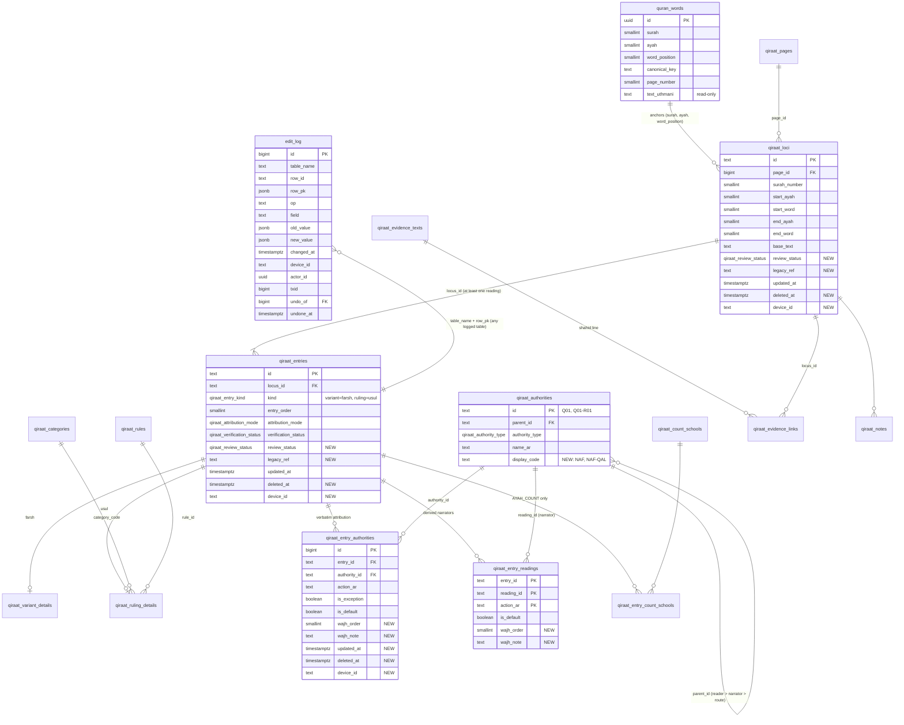

# Qiraat database schema (V2 entries model + Phase 2)

**Status:** Phase 2 DDL drafted and scratch-tested, **not applied to the live DB** (STOP GATE 2).
Migration: `supabase/migrations/20260924120000_qiraat_phase2_review_sync.sql` · Rollback: `supabase/rollbacks/20260924120000_qiraat_phase2_review_sync.down.sql`
Decisions: `docs/qiraat/QIRAAT_AUDIT.md` §9 (Q1 builds on the V2 model; no new parallel tables and no `_legacy` renames).

## How the model reads

- A **location** (`qiraat_loci`) is a word span in the Madani 1441 text, anchored to `quran_words` by (surah, ayah, word position).
- A **reading** (`qiraat_entries`) is one وجه at that location. `kind = variant` is فرش; `kind = ruling` is أصول, with its category in `qiraat_ruling_details.category_code`.
- **Who reads it**: `qiraat_entry_authorities` holds the attribution as the source states it (a reader, a narrator, «عدا», «الباقون»). `qiraat_entry_readings` is derived from it by trigger and always lists narrators.
- **Hafs is the baseline (D8).** Only differences from Hafs are stored. A narrator who reads like Hafs at a location is implied and not stored. Hafs (`Q05-R02`) may appear only as a further wajh (`wajh_order >= 2`) with a `wajh_note` (Q13).
- `quran_words` is the verified Hafs text (Q3) and is read-only. Views take the Hafs text from it and never retype it.

## ER diagram

## Dictionary: new and changed objects

### New type

| Type | Values | Meaning |
|---|---|---|
| `qiraat_review_status` | `unreviewed`, `reviewed`, `flagged` | Manual review state (separate from `verification_status`, which records the import pipeline). `flagged` is the quarantine: those rows are exempt from the D8 and one-narrator rules until rewritten. |

### New columns

| Table | Column | Type / default | Meaning |
|---|---|---|---|
| `qiraat_loci`, `qiraat_entries` | `review_status` | `qiraat_review_status`, NOT NULL, `'unreviewed'` | Review state of the location / reading. |
| `qiraat_loci`, `qiraat_entries` | `legacy_ref` | `text` | Where a migrated row came from (fixture `id` + page file, or DB-only key). |
| `qiraat_loci`, `qiraat_entries`, `qiraat_entry_authorities`, `qiraat_variant_details`, `qiraat_ruling_details`, `qiraat_evidence_texts`, `qiraat_evidence_links`, `qiraat_notes` | `deleted_at` | `timestamptz` | Soft delete. Views and rule checks ignore rows where it is set. Deleting this way lets the iOS app sync the removal. |
| same tables | `device_id` | `text` | Device that last wrote the row. Set by the writer, or from `SET LOCAL app.device_id = '…'`. |
| same tables except `qiraat_loci` / `qiraat_entries` (which already had it) | `updated_at` | `timestamptz`, NOT NULL, `now()` | Stamped on every insert/update by `qiraat_sync_stamp()`. The sync cursor for the iOS app. |
| `qiraat_entry_authorities`, `qiraat_entry_readings` | `wajh_order` | `smallint`, NOT NULL, `1` | 1 = the narrator's main wajh; 2+ = a further wajh (خلف / وجهان). CHECK `is_default = (wajh_order = 1)`. Backfilled: `is_default = false` → 2. |
| `qiraat_entry_authorities`, `qiraat_entry_readings` | `wajh_note` | `text` | Why this is a further wajh (e.g. the طريق). Required when Hafs appears. |
| `qiraat_authorities` | `display_code` | `text`, UNIQUE, CHECK `^[A-Z]{3}(-[A-Z]{3}){0,2}$` | Human-facing code. The keys stay `Q01` / `Q01-R01` (Q5). |

### Proposed `display_code` list (populated by the migration)

| Key | Reader / narrator | Code | | Key | Reader / narrator | Code |
|---|---|---|---|---|---|---|
| Q01 | نافع | NAF | | Q06 | حمزة | HAM |
| Q01-R01 | قالون | NAF-QAL | | Q06-R01 | خلف | HAM-KHL |
| Q01-R02 | ورش | NAF-WAR | | Q06-R02 | خلاد | HAM-KLD |
| Q02 | ابن كثير | IKT | | Q07 | الكسائي | KIS |
| Q02-R01 | البزي | IKT-BAZ | | Q07-R01 | أبو الحارث | KIS-ABH |
| Q02-R02 | قنبل | IKT-QUN | | Q07-R02 | الدوري عن الكسائي | KIS-DUR |
| Q03 | أبو عمرو | ABA | | Q08 | أبو جعفر | AJF |
| Q03-R01 | الدوري عن أبي عمرو | ABA-DUR | | Q08-R01 | ابن وردان | AJF-IWR |
| Q03-R02 | السوسي | ABA-SUS | | Q08-R02 | ابن جماز | AJF-IJM |
| Q04 | ابن عامر | IAM | | Q09 | يعقوب | YAQ |
| Q04-R01 | هشام | IAM-HSH | | Q09-R01 | رويس | YAQ-RWS |
| Q04-R02 | ابن ذكوان | IAM-IDH | | Q09-R02 | روح | YAQ-RWH |
| Q05 | عاصم | ASM | | Q10 | خلف العاشر | KHF |
| Q05-R01 | شعبة | ASM-SHU | | Q10-R01 | إسحاق | KHF-ISH |
| Q05-R02 | حفص | ASM-HAF | | Q10-R02 | إدريس | KHF-IDR |

The two الدوري stay distinct (`ABA-DUR`, `KIS-DUR`), and so do خلف عن حمزة (`HAM-KHL`) and خلف العاشر (`KHF`). A future route would take a third segment (e.g. `NAF-WAR-AZR`).

### New table: `edit_log` (D7)

| Column | Meaning |
|---|---|
| `id` | Identity. |
| `table_name`, `row_id`, `row_pk` | Which row changed. `row_pk` is `{pk column: value}` and is what undo uses. |
| `op` | `INSERT`, `UPDATE` or `DELETE`. |
| `field` | The changed column (UPDATE only; one log row per changed column; `updated_at` / `device_id` are not logged as fields). |
| `old_value`, `new_value` | `jsonb`: the field value for UPDATE, the whole row for INSERT (new) / DELETE (old). |
| `changed_at`, `device_id`, `actor_id`, `txid` | When, from which device, which signed-in user (`auth.uid()`), and in which transaction. |
| `undo_of`, `undone_at` | Rows written by an undo point at the row they reverse; the reversed row gets `undone_at`. |

Logged tables: `qiraat_loci`, `qiraat_entries`, `qiraat_entry_authorities`, `qiraat_variant_details`, `qiraat_ruling_details`, `qiraat_evidence_texts`, `qiraat_evidence_links`, `qiraat_notes`, `qiraat_authorities`. `qiraat_entry_readings` is not logged: it is derived from `qiraat_entry_authorities`, and undoing the attribution rebuilds it.

RLS is on with no policies, so only the service role / owner can read it. `SET LOCAL app.edit_log = 'off'` skips logging for bulk imports (Phase 3 writes its own report instead).

### New functions

| Function | Purpose |
|---|---|
| `edit_log_undo(log_id)` | Reverses one log row. UPDATE → restores the old value, but refuses with `UNDO_CONFLICT` if the field changed again since. INSERT → soft-deletes (or deletes, for tables without `deleted_at`). DELETE → re-inserts the row with its original id. Service role only. |
| `edit_log_undo_tx(txid)` | Reverses everything one transaction did: updates and inserts newest first, then re-inserts deleted rows parents first. Returns the count. |
| `qiraat_sync_stamp()` | Trigger: stamps `updated_at`, and `device_id` from the session setting. |
| `edit_log_capture()` | Trigger (`SECURITY DEFINER`): writes the log rows. |
| `qiraat_assert_entry_hafs_rule`, `qiraat_assert_locus_unique_narrators`, `qiraat_assert_locus_has_reading` | The three rule checks (`SECURITY DEFINER`, so RLS never hides rows from them). |
| `v_page_variants(page)` | Rows for the page review table, in reading order. |

### Changed function

`qiraat_rebuild_entry_readings(entry_id)`: now copies `wajh_order` / `wajh_note`, ignores soft-deleted attributions, and never adds Hafs through «عدا» / «الباقون» expansion (under D8 Hafs is implied). Explicit attributions are otherwise rebuilt exactly as before. The rollback restores the original body verbatim.

### Rules (deferred constraint triggers, checked at commit)

| Rule | Error | Scope |
|---|---|---|
| D8 / Q13: `Q05-R02` in a reading only with `wajh_order >= 2` and a non-empty `wajh_note`. Also catches reader-level `Q05` (عاصم), which expands to Hafs. | `QIRAAT_D8` | Live, non-REJECTED, non-flagged entries |
| One narrator per reading per location: within one location, kind and أصول category, a narrator has at most one `wajh_order = 1` reading. | `QIRAAT_NARRATOR_TWICE` | Same |
| At least one reading per location: a live location needs a live entry with a narrator (or a count school, for AYAH_COUNT). | `QIRAAT_EMPTY_LOCUS` | Live locations, flagged included |

They fire on writes, so existing rows are not re-checked when the migration is applied. `qiraat_qa_phase2_violations` lists existing rows that break them (on the 2026-09-23 data: D8 90, narrator twice 94, empty location 5). Phase 3 must bring the non-flagged count to zero.

### Indexes

`qiraat_loci (page_id, location_order)` and `(surah_number, start_ayah)` for live rows; `qiraat_entries (kind, locus_id)` for live rows; `qiraat_ruling_details (category_code, entry_id)`; review queue `qiraat_entries (review_status)` where not reviewed; sync cursors `qiraat_entries (updated_at)`, `qiraat_loci (updated_at)`. Page lookups resolve through the existing `quran_words_page_idx` and `quran_words_surah_ayah_word_position_key`.

### Views (all `security_invoker`, so the base tables' RLS still applies)

| View | Rows | Notes |
|---|---|---|
| `variant_locations` | One per live location | `page` = the Madani page of the first word (from `quran_words`), `word_start_id` / `word_end_id`, canonical keys, and `hafs_text` built from `quran_words.text_uthmani`. |
| `variant_readings` | One per live, non-REJECTED entry | `kind` = `farsh` / `usul`, category, reading text (فرش only), description, statuses. |
| `variant_reading_narrators` | One per derived narrator reading | `display_code`, `action_ar`, `wajh_order`, `wajh_note`. |
| `v_page_variant_rows` | Review-table rows | Joins the three views, with narrators as a `jsonb` array. AYAH_COUNT is left out. Narrators who read like Hafs are implied, not listed. |
| `qiraat_qa_phase2_violations` | Rule breaches in existing data | Service role only. |

Anonymous users see only VERIFIED/PUBLISHED entries through these views (tested), which today means none. The review screen (Phase 4) reads as the service role or a signed-in editor.

## Not changed

`quran_words` (checksum `52839d155fd0f90f999822a43e8198f5` before and after), the annotation engine tables and RPCs (`qiraat_editor_*`, `resolved_qiraat_cache`, batches), `qiraat_export_page`, the QA views, citations and الشواهد. The scratch regression probe gives byte-identical output for the editor catalog, page exports 1 / 245 / 584 and a create → update → soft-delete cycle through the editor RPCs, before and after the migration.
